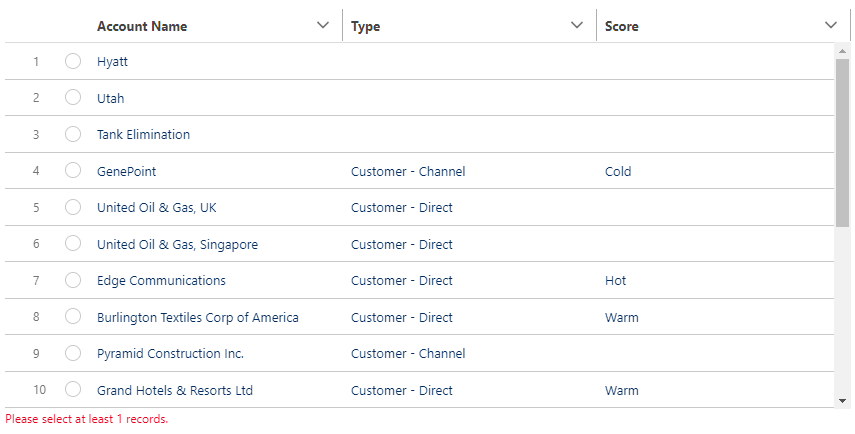

# LWC - Flow Data Selection Table
Lightning Web Component which can be used within Salesforce Lightning Flows to allow displaying, filtering and (multi-)selection on a given Collection of records without any client custom code needed.

## Challenge
There is an increase in usage of Screen Flows (both due to Salesforce's focus, but also the ability to guide a user through a proces). However, quite often one needs to display multiple fields from one record, or wants a user to be able to filter from a list. All these items requires a developer which might not be available, or the customer has a no-custom-project-code policy.

For this reason I've developed this component that we now use at multiple Deloitte clients' and which could be very powerful for other projects as well.

## The component
This Lightning Web Component allows to display, filter and select records which are provided as a Record Collection from the Flow. It is designed to be used in Screen Flows, but could in theory also be extended to use within another LWC.

To have efficient loading times only the first 20 records are initially shown and more records are automatically added when the user scrolls down (lazy-loading). The '20' is of course configurable to your project needs.

To ensure selections are kept and clearly visible for the end-user, even while applying different filters, the component automatically highlights the selected records on top of the datatable.

Example of simple display of records, showing the configured columns and applying a filter

Example of multi-select table where at most 2 records were allowed to be selected. Filter availability with Filter Field override to avoid '__c' to show in the filter placeholder.

Example of single-select (radio) table with a minimum validation of 1 record before continuing to the next screen and no filter.

### Required input:

| Variable | Description |
| --- | --- |
| in_records | Collection of records to show |
| in_displayFieldsString | Comma-separated list of Field API names to show as columns |
| in_selectionMax | Define maximum records a user can select: 0 > hide checkboxes; 1 > show radio; 2+ > show checkbox and restrict to specified number; 999 > no limit |

### Optional input:

| Variable | Description |
| --- | --- |
| in_selectionMin | Specify to require a least number of records, which will trigger a validation when less records are selected|
| in_displayLabelsString | Overrule API fieldnames in column headers with any other text. Note, when number of items in in_displayLabelsString doesn't match in_displayFieldsString, the Labels are ignored and API fieldnames are shown |
| in_filterFieldsString | Define whether the user can filter the records and which fields of the records can be filtered (note, it is possible to allow filtering on a field which isn't displayed) |
| in_filterLabelsString | Overrule API fieldnames in filter placeholder text with any other text. Note, when number of items in in_filterLabelsString doesn't match in_filterFieldsString, the Labels are ignored and API fieldnames are shown |
| | |
| in_initialNumRecords | Number of records to initially load and number to load additionally when user scrolls down (default: 20) |
| in_tableHeight | Configurable height of table to show (default: "400px"). Required to set a height, as otherwise the lazy-loading (on scroll loading) will not work, as there is no scroll, showing all records |

Example of input configurations

### Output (and input):

Below resources are available as both input and output, to allow the component to operate properly when a user moves to a next screen and then returns to e.g. alter some items. Note, the Admin should configure this variable in both the input and output section to make sure it behaves as expected.

| Variable | Description |
| --- | --- |
| filter | Textual filter entered by the user, or potentially pre-filled in the flow |
| selectedRecordList | Collection of SObjects the user selected |
| selectedRecord | Single SObject the user selected (only when in_selectionMax = 1). Available to avoid loop-complexity in Flows |

Example of output configurations (or one can use the automatic assignments)

## Know challenges / tips

* Ensure display and filter fields are part of the queried records to prevent issues
* Ensure the number of Labels matches the number of API fields (both for Display and Filter fields), else there will be no warning, only the Labels will be ignored

# Installation

The Component has been made available as unmanaged package (see links below) or can be retrieved from this repository and deployed to any Sandbox using SFDX CLI or an IDE.

* [Install on Sandbox Org](https://test.salesforce.com/packaging/installPackage.apexp?p0=04t08000000UJ0u)
* [Install on Production/Developer Org](https://login.salesforce.com/packaging/installPackage.apexp?p0=04t08000000UJ0u)

## Release Notes

**Version 1.1 - 2022-09-21**
* Introduced Filter Field Label override (to avoid '__c' in Filter placeholder)
* Made table height configurable
* Minor bug fix to properly handle null- or empty record collections

**Version 1.0 - 2022-09-21**
* Initial release